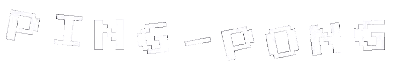

<div align="right">
    <a href="./README.md">🇺🇸 Read in English</a>
</div>

<p align="center">
  
</p>

<p align="center">
  A experiência clássica e viciante do Ping-Pong, desenvolvida em Python.
  <br />
  <a href="#caracteristicas"><strong>Explore as Funcionalidades »</strong></a>
  <br />
  <br />
</p>

---

## Sobre o Projeto

Ping-Pong é um jogo em Python que recria a experiência clássica dos arcades com um toque moderno.  
Possui diferentes arenas, power-ups, músicas e efeitos sonoros personalizados.

<a name="caracteristicas"></a>
### Principais Funcionalidades

- **Dois Modos de Jogo:**
    - **VS LOCAL:** Modo para jogar localmente contra seus amigos
    - **VS BOT:** Ninguém para jogar localmente? Sem problema, jogue contra o nosso bot
- **Múltiplas Arenas:** Escolha entre diferentes mapas e fundos.
- **Power-Ups Especiais:** As frutas concedem habilidades únicas (impulso de velocidade, raquetes espelhadas, etc).
- **Músicas e Efeitos Personalizados:** Trilha sonora imersiva com músicas e efeitos em .wav.
- **Sistema de Menu:** Navegue entre menu principal, seleção de arena e menu de pausa.
- **Compatibilidade com Qualquer OS:** Funciona com Python 3.x e sem dependências externas além de `pygame`.

### Capturas de Tela

<p align="center">
  
  <br>
  <em>Tela principal de jogo.</em>
</p>

<p align="center">
  
  <br>
  <em>Variedade de arenas para jogar.</em>
</p>

<p align="center">
  
  <br>
  <em>Evento acontecendo durante a partida.</em>
</p>

### Vídeo de Gameplay

<p align="center">
  <a href="https://www.youtube.com/watch?v=IHfQ1vLuy4g" target="_blank">
    
  </a>
  <br>
  <em>Assista a um teste de gameplay completo no YouTube.</em>
</p>

### Tecnologias Utilizadas

Este projeto foi desenvolvido com as seguintes tecnologias:

- **Linguagem:** Python 3
- **Bibliotecas:** Pygame (para renderização, controle de entrada e áudio)
- **Assets:** Sprites, sons e fontes personalizados

---

### Começando

#### Pré-requisitos
- Python 3.x instalado no seu sistema
- Gerenciador de pacotes `pip`

#### Instalação e Execução

1. **Clone o repositório:**
   ```sh
   git clone https://github.com/NONATO-03/ping-pong.git
2.  **Navegue até a pasta do projeto:**
    ```sh
    cd ping-pong
    ```
3.  **Crie e ative um ambiente virtual (recomendado):**
    ```sh
    python -m venv venv
    source venv\Scripts\activate  # On Linux, use `venv/bin/activate`
    ```
4.  **Instale os requisitos:**
    ```sh
    pip install -r requirements.txt
    ```
5.  **Execute o arquivo central**
    ```sh
    python main.py
    ```
### Author

Feito com ❤️ por **Vitor Nonato Nascimento**.

- **GitHub:** [https://github.com/NONATO-03](https://github.com/NONATO-03)


