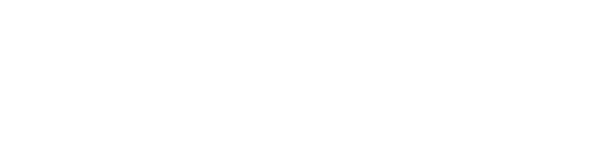
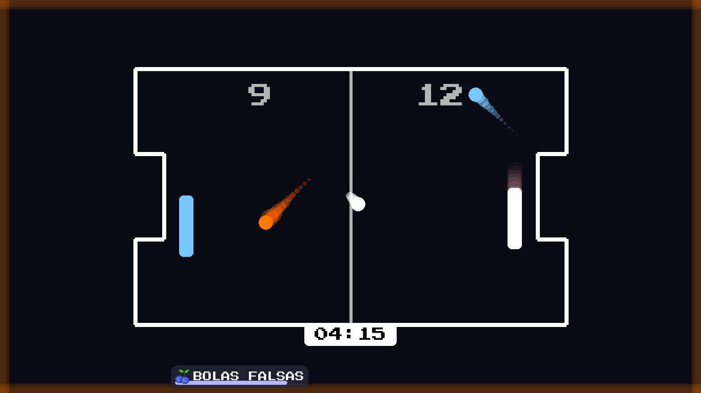

<div align="right">
    <a href="./README-pt.md">🇧🇷 Ler em Portugues-Brasil</a>
</div>

<div align="center">
  
</div>

<p align="center">
  The classic and addictive Ping-Pong experience, developed in Python.
  <br />
  <a href="#features"><strong>Explore the Features »</strong></a>
  <br />
  <br />
</p>

---

## About the Project

Ping-Pong is a Python game that recreates the classic arcade experience with a modern twist.  
It features different arenas, power-ups, custom music, and sound effects.

<a name="features"></a>
### Key Features

- **Two Game Modes:**
    - **VS LOCAL:** A local mode to play agaisnt your friends
    - **VS BOT:** Nobody locally to play? Sure, play agaisnt our bot
- **Multiple Arenas:** Choose from different maps and backgrounds.
- **Special Power-Ups:** Fruits grant unique abilities (speed boost, mirrored paddles, etc).
- **Custom Music & SFX:** Immersive sound design with .wav music and effects.
- **Menu System:** Navigate between main menu, arena selection, and pause menu.
- **Playable on Any OS:** Works with Python 3.x and no external dependencies besides `pygame`.

### Screenshots

<p align="center">
  
  <br>
  <em>The main game screen.</em>
</p>

<p align="center">
  
  <br>
  <em>Variety of arenas to  play within.</em>
</p>

<p align="center">
  
  <br>
  <em>Event feature in action.</em>
</p>

### Gameplay Video

<p align="center">
  <a href="https://www.youtube.com/watch?v=IHfQ1vLuy4g" target="_blank">
    
  </a>
  <br>
  <em>Watch a full gameplay test on YouTube.</em>
</p>


### Tech Stack

This project was built with the following technologies:

- **Language:** Python 3
- **Libraries:** Pygame (for rendering, input handling, and audio)
- **Assets:** Custom sprites, sounds, and fonts

---

### Getting Started

#### Prerequisites
- Python 3.x installed on your system
- `pip` package manager

#### Installation & Setup

1. **Clone the repository:**
   ```sh
   git clone https://github.com/NONATO-03/ping-pong.git
2.  **Navigate to the project directory:**
    ```sh
    cd ping-pong
    ```
3.  **Create and activate a virtual environment (recommended):**
    ```sh
    python -m venv venv
    source venv\Scripts\activate  # On Linux, use `venv/bin/activate`
    ```
4.  **Install the dependencies:**
    ```sh
    pip install -r requirements.txt
    ```
5.  **Run the main file**
    ```sh
    python main.py
    ```
### Author

Developed with ❤️ by **Vitor Nonato Nascimento**.

- **GitHub:** [https://github.com/NONATO-03](https://github.com/NONATO-03)
